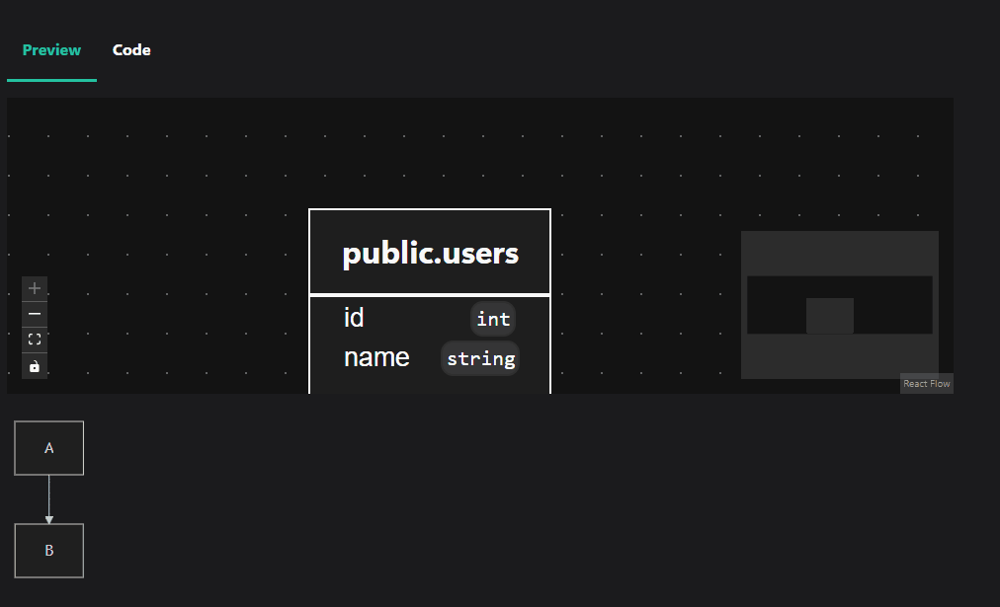

# Docusaurus Dbml Renderer Plugin

This plugin allows you to render Dbml diagrams in your Docusaurus site.



## Installation

```bash
npm install @wjmpantig/docusaurus-plugin-dbml @wjmpantig/react-dbml-renderer @dbml/core @xyflow/react
```

## Usage

```js
// docusaurus.config.ts

import { remarkDbmlToComponent } from '@wjmpantig/docusaurus-plugin-dbml';

export default function config() {
  return {
    plugins: [
      ['@wjmpantig/docusaurus-plugin-dbml'], //add me
    ],
    docs: {
      remarkPlugins: [remarkDbmlToComponent], // add me
    },
  };
}
```
