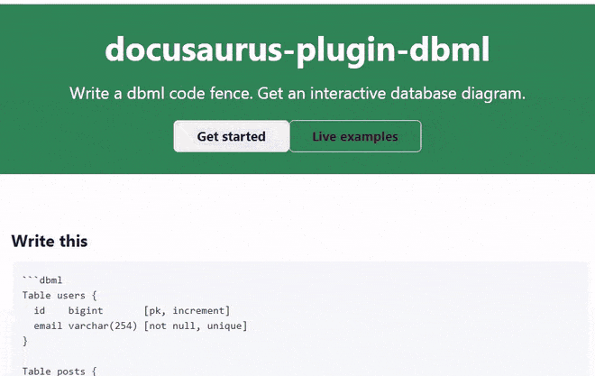

# Docusaurus Dbml Renderer Plugin

Render [DBML](https://dbml.dbdiagram.io/docs/) schemas as interactive diagrams in
your Docusaurus site. Write a fenced code block, get a diagram.



**[Documentation and live examples →](https://wjmpantig.github.io/docusaurus-plugin-dbml/)**

## Installation

```bash
npm install @wjmpantig/docusaurus-plugin-dbml @wjmpantig/react-dbml-renderer @dbml/core @xyflow/react
```

## Usage

Register the remark plugin for each content type you write Markdown in:

```ts
// docusaurus.config.ts
import { remarkDbmlToComponent } from '@wjmpantig/docusaurus-plugin-dbml';

export default {
  presets: [
    [
      'classic',
      {
        docs: {
          sidebarPath: './sidebars.ts',
          remarkPlugins: [remarkDbmlToComponent], // add me
        },
      },
    ],
  ],
  plugins: ['@wjmpantig/docusaurus-plugin-dbml'], // optional
};
```

Then write a diagram:

````md
```dbml
Table users {
  id integer [primary key]
  name varchar
}
```
````

## Options

`height` sets the preview height, `500` by default. Pass it globally
(`[[remarkDbmlToComponent, { height: 400 }]]`) or per diagram with the fence meta
(` ```dbml height=600 `). Numbers are pixels; strings are any CSS length.

Full reference: **[Configuration](https://wjmpantig.github.io/docusaurus-plugin-dbml/docs/configuration)**.

The component can also be [used directly](https://wjmpantig.github.io/docusaurus-plugin-dbml/docs/standalone),
without a code fence.

## Requirements

Peer dependencies: `@wjmpantig/react-dbml-renderer` v2, `@dbml/core` v10,
`@xyflow/react` v12, React 19.

## License

MIT
